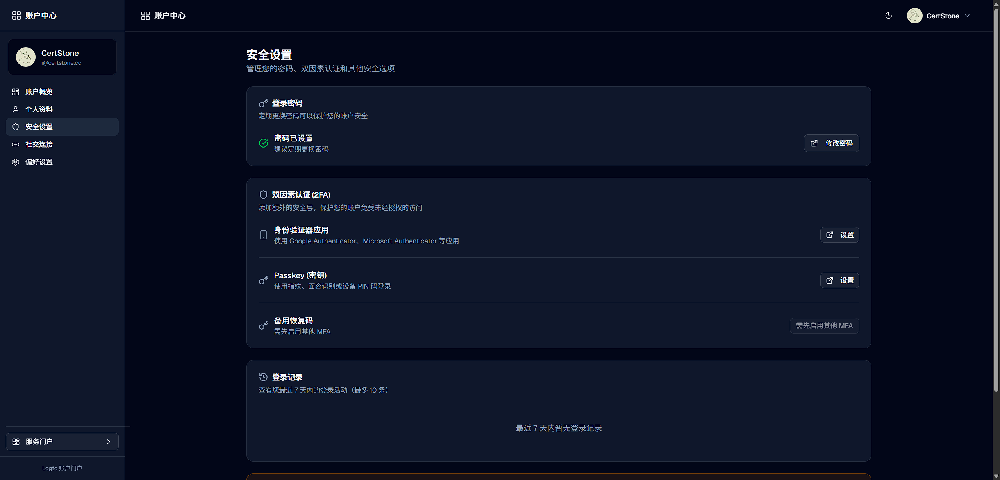
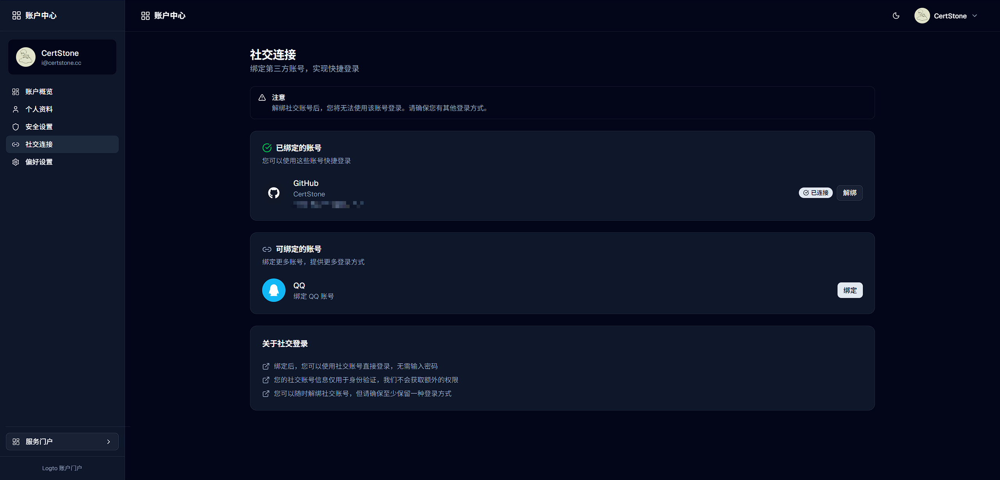

# Logto Account Portal

Logto Account Portal is an account center and service portal integrated with [Logto](https://logto.io/), providing profile management, security settings, social account linking, and more. It supports both local development and Docker deployment with a unified and easy-to-manage configuration model.

The project is built with Next.js 15 (App Router), and the frontend UI uses shadcn/ui.

## 1. Features

### Account Center (Dashboard)

- Profile management (avatar, name, profile fields)
- Security settings (password, MFA, passkey, login history)
- Social account link/unlink (Google/GitHub/QQ, etc.)
- Login history and account deletion
- Language and theme (light/dark) switching

### Service Portal (Portal)

- Config-driven service listing
- Service category navigation
- Keyword search
- Service health checking

## 2. UI Preview

Dashboard (Dark Mode):


Profile (Light Mode):


Security Page (Dark):



Social Connections (Dark):



Portal Page (Light):


## 3. Configuration Convention

For both local development and Docker deployment, use these paths consistently:

- `/.env`
- `/deploy/features.yaml`
- `/deploy/services.yaml`

The repository only contains example files:

- `/.env.example`
- `/deploy/features.yaml.example`
- `/deploy/services.yaml.example`

## 4. Local Development

### 1) Install dependencies

```bash
npm install
```

### 2) Prepare config files

```bash
cp .env.example .env
cp deploy/features.yaml.example deploy/features.yaml
cp deploy/services.yaml.example deploy/services.yaml
```

### 3) Update configuration for your environment

See [docs/configuration-guide.en.md](docs/configuration-guide.en.md).

### 4) Start development server

```bash
npm run dev
```

Visit: `http://localhost:3000`

## 5. Docker Deployment

### 1) Prepare deployment directory

```bash
mkdir -p account-center/deploy
cd account-center
```

### 2) Download config templates

```bash
curl -fsSL -o .env https://raw.githubusercontent.com/CertStone/logto-account-portal/main/.env.example
curl -fsSL -o deploy/features.yaml https://raw.githubusercontent.com/CertStone/logto-account-portal/main/deploy/features.yaml.example
curl -fsSL -o deploy/services.yaml https://raw.githubusercontent.com/CertStone/logto-account-portal/main/deploy/services.yaml.example
curl -fsSL -o docker-compose.yml https://raw.githubusercontent.com/CertStone/logto-account-portal/main/docker-compose.yml
```

Edit `.env` / `deploy/*.yaml` before startup. See [docs/configuration-guide.en.md](docs/configuration-guide.en.md).

### 3) Start services

```bash
docker compose pull
docker compose up -d
```

View logs:

```bash
docker compose logs -f app
```

## 6. Highlights

- **Unified configuration model**: `.env + deploy/*.yaml` for both dev and deployment
- **Runtime configuration loading**: restart container after config change to apply
- **Built-in config validation**: env/yaml validated before app startup to reduce runtime config errors
- **Clear auth boundaries**: user token and M2M token are separated to reduce privilege misuse risk
- **Frontend/backend decoupling**: client reads public config via `/api/public-config`

## 7. Configuration Guide

See: `docs/configuration-guide.en.md`

## 8. License

[MPL-2.0 License](LICENSE)
